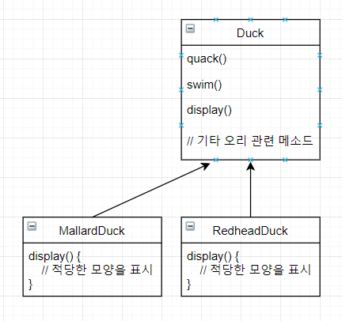
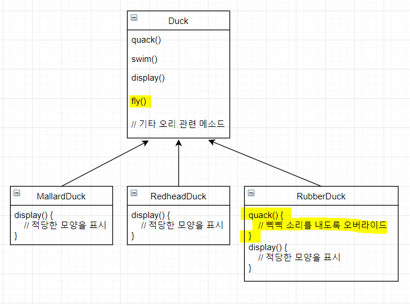
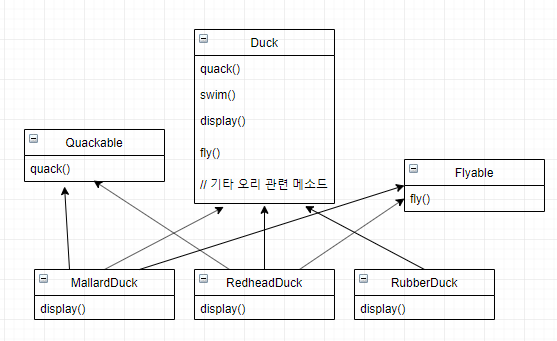
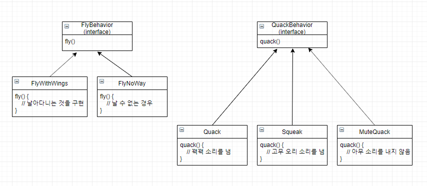
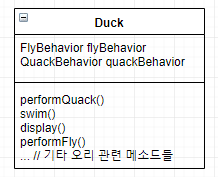
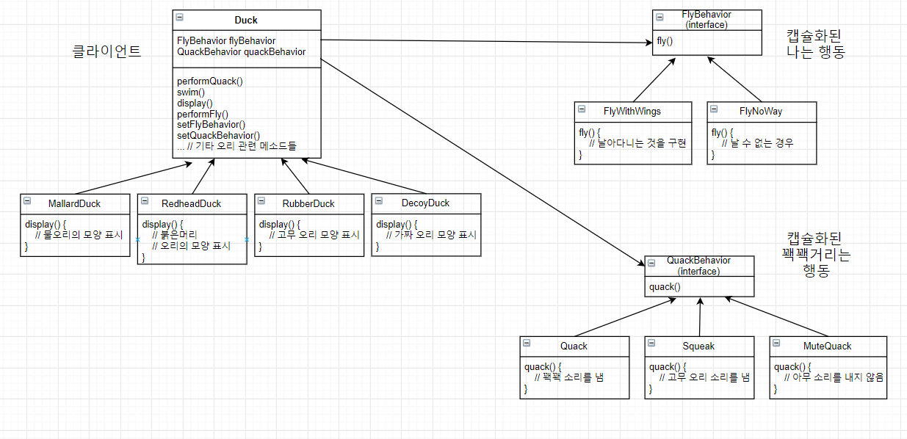

# Strategy Pattern

## 개념
Strategy Pattern이란 알고리즘군을 정의하고 각각을 캡슐화하여 교환해서 사용할 수 있도록 만든다. Strategy를 활용하면 알고리즘을 사용하는 클라이언트와는 독립적으로 알고리즘을 변경할 수 있다. 즉, 동적으로 알고리즘을 교체할 수 있는 구조를 말한다.

먼저 Duck이라는 슈퍼클래스와 각각의 오리별 클래스인 MallardDuck, RedheadDuck를 구현해보자.
  
> 위의 구조를 설명하자면 Duck 클래스에선 모든 오리들이 소리를 내고 헤엄을 칠 수 있어 quack(), swim() 메소드를 구현했고 오리들의 모양이 각각 다르기 때문에 display() 메소드는 추상 메소드이다. 그 외에도 다른 유형의 오리들이 Duck 클래스로부터 상속을 받는다.

여기서 만약 모든 오리들을 날게하려면 아래와 같이 Duck 클래스에 fly() 메소드만 추가하면 된다. 또한 고무오리는 소리가 다르므로 RubberDuck 클래스에 quack() 메소드를 오버라이드하여 "삑삑" 소리가 나도록 한다.


> 하지만 여기서 문제가 생겼다. Duck의 모든 서브클래스가 날 수 있는 것은 아니라는 점이다. 예를들어 동물이 아닌 고무 오리가 날아다니는 불상사가 생기게 된다.

여기서 고무오리는 날지못하므로 fly() 메소드도 오버라이드하여 아무것도 하지 않게 만든다. -> **여기서 상속을 활용하는 것이 옳은 방법이 아니다. 만약 이렇게 계속 구현하게 된다면 매번 상황에 따라 Duck의 서브클래스의 fly()와 quack()메소드를 일일이 살펴봐야 하고, 오버라이드 또한 해야할 수도 있다.**

상속이 올바른 해법이 아닌것을 알게되고 만약 서브클래스에서 Flyable, Quackable라는 interface를 구현하게 된다면 예를들어 Flyable()이라는 interface를 날 수 있는 오리에게만 상속하도록 하면 될꺼라 생각해보고 아래와 같은 이미지로 디자인을 생각해보자.  


> 위와 같이 디자인할 경우 고무 오리가 날아다니는 일이 없는 것과 같이 일부 문제점은 해결되지만 interface의 특성상 구현체만 만들 수 있으므로 **행동에 대한 코드 재사용성을 전혀 기대할 수 없으므로 관리면에서 문제점이 생긴다.** -> 즉, 하나의 행동을 변경할 때마다 그 행동이 정의되어 있는 서로 다른 서브클래스들을 전부 찾아서 코드를 일일이 고쳐야 하는 거지같은 일이 생기게 된다.

`하지만 이러한 상황에서 어울리는 디자인 원칙을 생각해보자.`

```
애플리케이션에서 달라지는 부분을 찾아 내고, 달라지지 않는 부분으로부터 분리시킨다.
-> 바뀌는 부분을 따로 뽑아서 캡슐화시킨다. 그렇게 하면 나중에 바뀌지 않는 부분에는 영향을 미치지 않은 채로 그 부분만 고치거나 확장할 수 있다.
```

위의 원칙을 토대로 확인해보면 Duck 클래스에서 fly()와 quack()는 오리마다 달라지는 부분이다.
해당 메소드들을 모두 Duck 클래스에서 빼내어 각 행동을 나타낼 클래스 집합을 새로 만들도록 하자.

`여기서 두 번째 디자인 원칙`

```
구현이 아닌 인터페이스에 맞춰서 프로그래밍한다.
```

각 행동은 interface로 표현하고 행동을 구현할 때 이런 interface를 구현하도록 하고 구체적인 행동을 구현하는 클래스들을 만들어보자.


> 위와 같이 디자인하면 다른 형식의 객체에서도 나는 행동과 꽥꽥거리는 행동을 재사용할 수 있다. 그리고 기존의 행동 클래스를 수정하거나 날아다니는 행동을 사용하는 Duck 클래스를 건드리지 않고 새로운 행동을 추가할 수 있다. 

## 실습
우선 Duck 클래스에 flyBehavior과 quackBehavior라는 두 개의 인터페이스 형식의 인스턴스 변수를 추가할 것이다.


`이제 코드를 구현해보자.`

1. 이전 과정이였던 개념단계의 클래스 및 인터페이스들을 코드화시킨다.
   - FlyBehavior
     ```
        public interface FlyBehavior {
            void fly();
        }
     ```
   - QuackBehavior
     ```
        public interface QuackBehavior {  
            void quack();  
        }        
     ```
   - Duck
     ```
        public class Duck {
            // 모든 Duck에는 QuackBehavior, FlyBehavior 인터페이스를 구현하는 것에 대한 레퍼런스가 있다.
            QuackBehavior quackBehavior;
            FlyBehavior flyBehavior;

            public void performQuack() {
                // 꽥꽥거리는 행동을 직접 처리하는 대신 quackBehavior로 참조되는 객체에 그 행동을 위임한다.
                quackBehavior.quack();
            }

            public void performFly() {
                flyBehavior.fly();
            }

            public void swim() {}

            public void display() {}

            // 기타 오리 관련 메소드
            ...
        }
     ```
   - FlyWithWings
     ```
        public class FlyWithWings implements FlyBehavior {
            @Override
            public void fly() {
                System.out.println("날아다닌다.");
            }
        }
     ```
   - FlyNoWay
     ```
        public class FlyNoWay implements FlyBehavior {
            @Override
            public void fly() {
                System.out.println("날 수 없다.");
            }
        }

     ```     
   - Quack
     ```
        public class Quack implements QuackBehavior {
            @Override
            public void quack() {
                System.out.println("꽥꽥.");
            }
        }
     ```     
   - Squeak
     ```
        public class Squeak implements QuackBehavior {
            @Override
            public void quack() {
                System.out.println("삑삑(고무오리 소리).");
            }
        }
     ```   
   - MuteQuack
     ```
        public class MuteQuack implements QuackBehavior {
            @Override
            public void quack() {
                System.out.println("아무 소리를 내지 않음");
            }
        }
     ```       

2. flyBehavior과 quackBehavior의 인스턴스 변수를 설정하자.
   - MallardDuck
     ```
        public class MallardDuck extends Duck {
            public MallardDuck() {
                // 꽥꽥거리는 소리를 처리할 때 Quack 클래스를 사용하기 때문에 Duck클래스의 performQuack()이 호출되면 꽥꽥거리는 행동을 Quack 객체에게 위임된다.
                quackBehavior = new Quack();
                flyBehavior = new FlyWithWings();
            }

            public void display() {
                System.out.println("저는 물오리입니다.");
            }
        }
     ```

3. 메인 클래스를 만들어 컴파일을 하자.
   - DuckSimulator
     ```
        public class DuckSimulator {
            public static void main(String[] args) {
                Duck mallard = new MallardDuck();
                // MallardDuck에서 상속받은 performQuack() 메소드가 호출되며 이 메소드에서는 객체의 QuackBehavior에게 할 일을 위임한다. (즉, quackBehavior 레퍼런스의 quack() 메소드가 호출된다.)
                mallard.performQuack();
                mallard.performFly();
            }
        }
     ```     
   > [결과]  
   > 꽥꽥.  
   > 날아다닌다.

4. MallardDuck 클래스를 수정한 결과값으로 이해해보자.
   - MallardDuck
     ```
        public class MallardDuck extends Duck {
            public MallardDuck() {
                // Quack -> Squeak 로 변경
                quackBehavior = new Squeak();
                flyBehavior = new FlyWithWings();
            }

            public void display() {
                System.out.println("저는 물오리입니다.");
            }
        }
     ```
   > [결과]  
   > 삑삑(고무오리 소리).  
   > 날아다닌다.     

   `위와 같이 오리의 유형에따라 quackBehavior에 할당하는 행동 객체만 변경해주면 유연한 수정이 가능하다.`    


## 실습(동적 행동 지정)
위의 실습한 내용을 동적으로 행동을 지정할 수 있게 변경해보자.

1. Duck 클래스에 메소드 두 개를 새로 추가
   ```
    public void setFlyBehavior(FlyBehavior fb) {
        flyBehavior = fb;
    }

    public void setQuackBehavior(QuackBehavior qb) {
        quackBehavior = qb;
    }    
   ```
   `오리의 행동을 즉석에서 바꾸고 싶을 때 해당 두 메소드를 호출하면 된다.`

2. Duck의 서브클래스를 작성(ModelDuck.java)
   ```
    public class ModelDuck extends Duck {
        public ModelDuck() {
            flyBehavior = new FlyNoWay();
            quackBehavior = new Quack();
        }

        public void display() {
            System.out.println("저는 모형 오리입니다.");
        }
    }

   ```   

3. 동적으로 행동을 지정할 FlyBehavior 형식의 클래스를 새로 만든다.(FlyRocketPowered.java)
   ```
    public class FlyRocketPowered implements FlyBehavior {
        public void fly() {
            System.out.println("로켓 추진으로 날아갑니다.");
        }
    }
   ```

4. Main 클래스를 수정하자(동적으로 행동을 부여)
   - DuckSimulator
     ```
        public class DuckSimulator {
            public static void main(String[] args) {
                Duck mallard = new MallardDuck();
                mallard.performQuack();
                mallard.performFly();

                Duck model = new ModelDuck();
                model.performFly();
                // Setter에 FlyRocketPowered를 전달하면 오리에 로켓의 추진력으로 날 수 있는 능력이 생긴다.
                model.setFlyBehavior(new FlyRocketPowered());
                // 동적으로 나는 행동이 바꿀 수 있다.
                model.performFly();
            }
        }
     ```
    > [결과]  
    > 삑삑(고무오리 소리).  
    > 날아다닌다.  
    > 날 수 없다.  
    > 로켓 추진으로 날아갑니다.  

    `즉, 실행중에 오리의 행동을 바꾸고 싶으면 원하는 행동에 해당하는 Duck의 Setter 메소드를 호출하기만 하면 된다.`


## 캡슐화된 행동을 전체적인 디자인을 정리해보자.

FlyBehavior과 QuackBehavior은 각각 행동과 꽥꽥거리는 행동을 위임 받는다. 이렇게 두 클래스를 합치는 것을 구성(composition)을 이용한다고 한다. 여기에 나와있는 오리 클래스에서는 행동을 상속받는 대신, 올바른 행동 객체로 구성됨으로써 행동을 부여받게 된다.

`이것은 세 번째 디자인 원칙 즉, 상속보다는 구성을 활용한다.`

위의 구성처럼 시스템을 만들면 유연성을 크게 향상시킬 수 있다. 
단순히 알고리즘군을 별도의 클래스의 집합으로 캡슐화할 수 있도록 만들어주는 것 뿐 아니라, 구성요소로 사용하는 객체에서 올바른 행동 인터페이스를 구현하기만 하면 실행시에 행동을 바꿀 수도 있게 해준다.

## 참고: Head First Design Patterns
