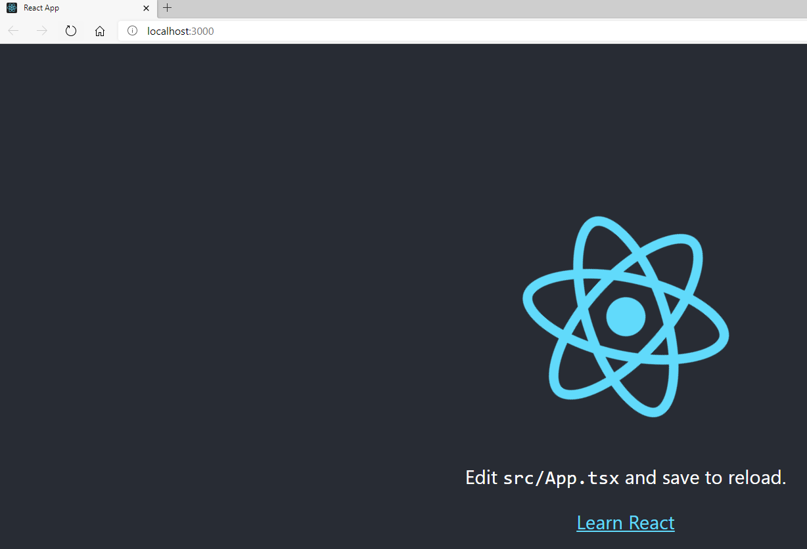
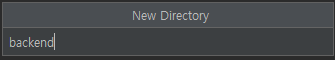
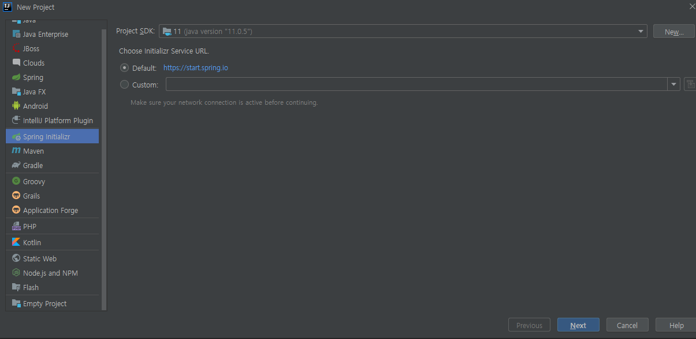
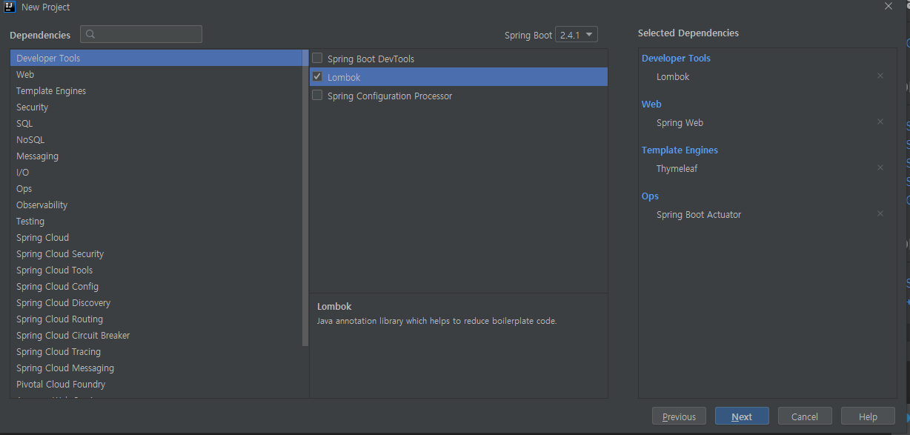
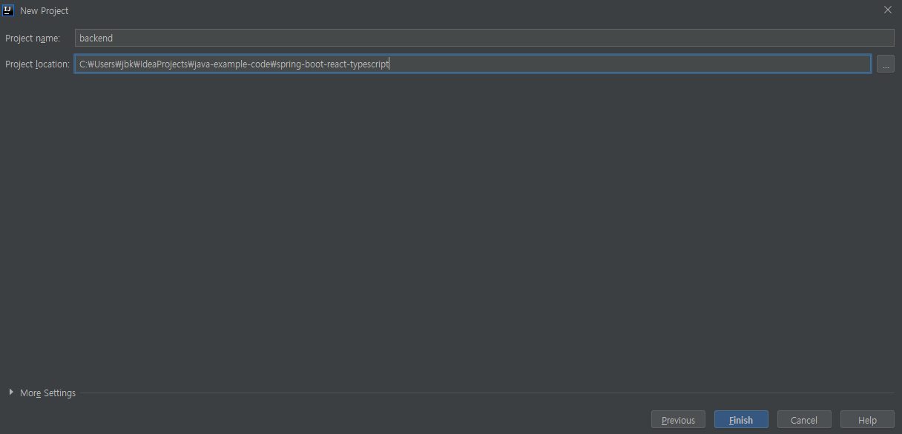
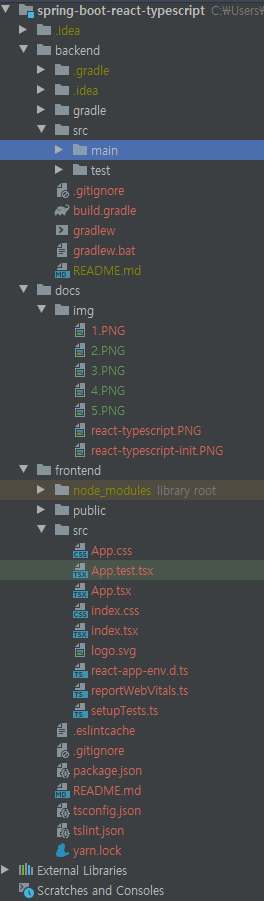

Spring Boot + Gradle + Vuejs
=========

https://bkjeon1614.tistory.com/39


## Development Environment 
* IDE : IntelliJ IDEA Ultimate
* SpringBoot 2.4.1
* Java 11
* Gradle

## Setup

### Prerequisites

#### Install Yarn (MacOSX)
```
    $ brew install node
    $ brew install yarn
```

#### Install Yarn (Linux)
```
    $ sudo apt-get update
    $ sudo apt-get install node
    $ npm install -g yarn
```

#### Install Yarn (Windows)
```
    $ choco install npm
    $ choco install yarn
```

#### CRA with Typescript
```
    $ yarn create react-app frontend --template typescript
```

#### ESLint + Prettier
- Dependency 설치
  ```
      $ yarn add -D prettier @typescript-eslint/eslint-plugin @typescript-eslint/parser eslint-config-prettier eslint-plugin-prettier eslint-plugin-react
  ```
- .eslintrc 설정
  [.eslintrc]
  ```
    {
      "parser": "@typescript-eslint/parser",
      "extends": [
        "plugin:react/recommended",
        "plugin:@typescript-eslint/recommended",
        "plugin:prettier/recommended"
      ],
      "plugins": ["react", "@typescript-eslint", "prettier"],
      "parserOptions": {
        "ecmaVersion": 6,
        "ecmaFeatures": {
          "jsx": true
        }
      },
      "rules": {
        "@typescript-eslint/explicit-module-boundary-types": ["off"]
      },
      "ignorePatterns": ["dist", "node_modules"],
      "settings": {
        "react": {
          "version": "detect"
        }
      }
    }
  ```  
- .prettierrc 설정
  [.prettierrc]
  ```
    {
      "singleQuote": true,
      "printWidth": 100,
      "tabWidth": 2,
      "useTabs": false,
      "semi": false,
      "parser": "typescript",
      "trailingComma": "all"
    }
  ```
- package.json 설정
  [package.json]
  ```
    ...
    "script": {
      "format": "prettier --write src/**/*.{js,jsx,ts,tsx}",
      "lint": "eslint src/**/*.{js,jsx,ts,tsx}",
      "lint:fix": "eslint --fix src/**/*.{js,jsx,ts,tsx}"    
    }
    ...
  ```

#### lint-staged + husky
- lint-staged 설치
  ```
    $ yarn add --dev lint-staged
  ```
- husky 설치
  ```
    $ yarn add --dev husky
  ```  
- package.json 설정
  [package.json]
  ```
    ...
    "script": {
      ...
      "precommit": "lint-staged"
    },
    "husky": {
        "hooks": {
          "pre-commit": "lint-staged"
        }
    },
    "lint-staged": {
        "*.{js,jsx,ts,tsx}": [
          "prettier --write",
          "git add ."
        ]
    },    
    ...
  ```


#### ES LINT + Prettier Setting
- 2019년에 TSLint 팀은 더이상 TSLint를 지원하지 않기로 결정 (https://github.com/palantir/tslint/issues/4534)
- 경로이동
  ```
    $ cd frontend
  ```
- 설치
  ```
    $ npm i -D eslint eslint-config-airbnb eslint-config-prettier eslint-plugin-import eslint-plugin-jsx-a11y eslint-plugin-prettier eslint-plugin-react eslint-plugin-react-hooks @typescript-eslint/parser @typescript-eslint/eslint-plugin prettier
  ```
- .eslintrc 추가
  [.eslintrc]   
  ```
    {
      "extends": [
        "prettier",
        "airbnb",
        "airbnb/hooks",
        "prettier/react",
        "plugin:@typescript-eslint/recommended",
        "prettier/@typescript-eslint",
        "plugin:prettier/recommended"
      ],
      "parser": "@typescript-eslint/parser",
      "plugins": ["@typescript-eslint"]
    }
  ```
- .prettierrc 파일 생성  
  [.prettierrc]
  ```
    {
      "singleQuote": true,
      "parser": "typescript",
      "semi": false,
      "useTabs": true,
      "tabWidth": 2,
      "printWidth": 120,
      "trailingComma": "all"
    }
  ```   
- package.json 파일의 scripts 에 prettier 를 추가  
  [package.json]
  ```
    ...
    "scripts": {
        ...
        "prettier": "prettier --write --config ./.prettierrc \"**/*.{ts,tsx}\"",
        "lint": "eslint './src/**/*.{ts,tsx}'",
        "lint:fix": "eslint --fix './src/**/*.{ts,tsx}'"
    }
    ...     
  ```
- eslint ignore 설정
  [.eslintignore]
  ```
    /node_modules
  ```
- 실행
  - `코드입력 => prettier => eslint => 코드수정` 순서로 실행
    - 자동으로 코드 스타일 변경
      ```
        $ npm run prettier
      ```
    - 규칙검사
      ```
        $ npm run lint
      ```
- 에러
  - This is probably not a problem with npm. There is likely additional logging output above.
    ```
        $ yarn install
    ```


#### Build Run
```
    $ cd frontend
    $ yarn start
```
http://localhost:3000 에서 확인


## Project setup
```
spring-react-typescript
├─┬ spring-react-typescript
├─┬ backend     → backend module with Spring Boot code
│ src
│  ├── main
│  └── resources
│        └── application.yml
├─┬ frontend    → frontend module with Vue.js code
│ ├── src
│ ├── config
│       └── index.js    → build path ( move: resources/templates/* )
└── build.gradle    
```

# [Additional Information]
## Spring Boot Vuejs Multi Project (intellij)

Step 1. 프로젝트 경로에 backend 폴더 생성


Step 2. File -> New -> Project -> Spring Initializr 선택 후 Next  


Step 3. 필요한 정보를 입력한다.


Step 4. 필요한 모듈을 선택한다.


Step 5. backend 폴더가 있는 경로에 프로젝트 생성 경로를 지정하고 Finish 선택


> Project Structure  

