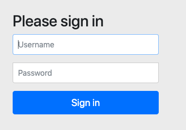

Spring Boot + Spring Security + Mybatis + Thymeleaf + Gradle 로그인 기능 구현
=========


## [Document]
Tistory: -
Github: https://github.com/bkjeon1614/java-example-code/tree/master/spring-boot-security-mybatis

## [Development Environment]
* IDE : IntelliJ IDEA Ultimate
* SpringBoot 2.1.1.RELEASE
* Java8
* Gradle

## [Example]
- 테이블 생성
  - ./src/resources/static/db/member.sql의 명시되어있는 쿼리로 테이블 및 데이터를 생성
    ```
    CREATE TABLE `role` (
        `role_id` int(11) NOT NULL AUTO_INCREMENT,
        `role` varchar(255) DEFAULT NULL,
        PRIMARY KEY (`role_id`)
    ) ENGINE=InnoDB DEFAULT CHARSET=utf8;

    INSERT INTO `role` VALUES (1,'ADMIN');

    CREATE TABLE `user` (
      `user_id` int(11) NOT NULL AUTO_INCREMENT,
      `active` int(11) DEFAULT 0,
      `login_id` varchar(255) NOT NULL,
      `user_name` varchar(255) NOT NULL,
      `password` varchar(255) NOT NULL,
      PRIMARY KEY (`user_id`)
    ) ENGINE=InnoDB DEFAULT CHARSET=utf8;

    CREATE TABLE `user_role` (
      `user_id` int(11) NOT NULL,
      `role_id` int(11) NOT NULL,
      PRIMARY KEY (`user_id`,`role_id`)
    ) ENGINE=InnoDB DEFAULT CHARSET=utf8;
    ```

- application.yml 설정
  ```
  ```

- 의존성 설정
  ```
  dependencies {
    ....


  }
  ```
  
- Lombok 활성화 [포스팅 필요]  
  
- 시큐리티 적용 확인(의존성에 추가하고 애플리케이션을 구동하여 http://localhost:8080으로 확인 시 아래와 같은 화면을 볼 수 있다.)
  

- entity 추가
  - member에 entity패키지에 User.java를 생성한다. (유저정보에 대한 entity class이다.)
    ```
    package com.example.sample.member.entity;

    import lombok.Getter;
    import lombok.Setter;

    @Getter
    @Setter
    public class User {
      private int id;
      private String password;
      private String loginId;
      private String userName;
      private int active;
      private String accessToken;
    }
    ```
  
  - member에 entity패키지에 Role.java를 생성한다. (권한관련 entity class이다.)
    ```
    package com.wmp.admin.member.entity;
  
    import lombok.Getter;
    import lombok.Setter;
  
    @Getter
    @Setter
    public class Role {
      private int id;
  	  private String role;
    }
    ```

  - member에 entity패키지에 UserRole.java를 생성한다. (유저별 권한을 관리하는 entity class이다.)
    ```
    package com.wmp.admin.member.entity;
  
    import lombok.Getter;
    import lombok.Setter;
  
    @Getter
    @Setter
    public class UserRole {
  	  private int userId;
  	  private int roleId;
    }
    ```

- mapper 추가
  - member에 mapper패키지에 UserMapper.java를 생성한다.
    ```
    package com.example.sample.member.mapper;
  
    import com.example.sample.member.entity.User;
    import org.apache.ibatis.annotations.Mapper;
    import org.apache.ibatis.annotations.Param;
    import org.springframework.stereotype.Component;
    import org.springframework.transaction.annotation.Transactional;
  
    @Component
    @Mapper
    public interface UserMapper {
        @Transactional(readOnly = true)
        User findUserByLoginId(@Param("loginId") String loginId);
  
        @Transactional
        int setUserInfo(@Param("param") User param);
    }
    ```
  
  - member에 mapper패키지에 RoleMapper.java를 생성한다.
    ```
    package com.example.sample.member.mapper;
  
    import com.example.sample.member.entity.Role;
    import org.apache.ibatis.annotations.Mapper;
    import org.apache.ibatis.annotations.Param;
    import org.springframework.stereotype.Component;
    import org.springframework.transaction.annotation.Transactional;
  
    @Component
    @Mapper
    public interface RoleMapper {
        @Transactional(readOnly = true)
        Role getRoleInfo(@Param("role") String role);
    }
    ```
  
  - member에 mapper패키지에 UserRoleMapper.java를 생성한다.
    ```
    package com.example.sample.member.mapper;
  
    import com.example.sample.member.entity.UserRole;
    import org.apache.ibatis.annotations.Mapper;
    import org.apache.ibatis.annotations.Param;
    import org.springframework.stereotype.Component;
    import org.springframework.transaction.annotation.Transactional;
  
    @Component
    @Mapper
    public interface UserRoleMapper {
  
        @Transactional
        void setUserRoleInfo(@Param("param") UserRole param);
  
    }
    ```

- mapper.xml 추가
  - ./src/main/resources/mapper/member에 UserMapper.xml를 생성한다.
    ```
    <?xml version="1.0" encoding="UTF-8" ?>
    <!DOCTYPE mapper PUBLIC "-//mybatis.org//DTD Mapper 3.0//EN"
      "http://mybatis.org/dtd/mybatis-3-mapper.dtd">
    
    <mapper namespace="com.example.sample.member.mapper.UserMapper">
    
        <resultMap id="User" type="com.example.sample.member.entity.User">
            <result property="id" column="user_id" />
            <result property="active" column="active" />
            <result property="loginId" column="login_id" />
            <result property="userName" column="user_name" />
            <result property="password" column="password" />
            <result property="accessToken" column="access_token" />
        </resultMap>
    
        <select id="findUserByLoginId" resultMap="User">
            SELECT
                user_id, active, login_id, user_name, password
            FROM
                user
    
            <where>
    
                <if test=" loginId != null and loginId != '' ">
                    AND login_id = #{loginId}
                </if>
    
            </where>
    
        </select>
    
        <insert id="setUserInfo" parameterType="com.example.sample.member.entity.User" useGeneratedKeys="true" keyProperty="param.id">
            INSERT INTO user
            (
                active, login_id, user_name, password
            )
            VALUES
            (
                #{param.active}, #{param.loginId}, #{param.userName}, #{param.password}
            )
        </insert>
    
    </mapper>
    ```
    
  - ./src/main/resources/mapper/member에 RoleMapper.xml를 생성한다.
    ```
    <?xml version="1.0" encoding="UTF-8" ?>
    <!DOCTYPE mapper PUBLIC "-//mybatis.org//DTD Mapper 3.0//EN"
      "http://mybatis.org/dtd/mybatis-3-mapper.dtd">
    
    <mapper namespace="com.example.sample.member.mapper.RoleMapper">
    
        <resultMap id="Role" type="com.example.sample.member.entity.Role">
            <result property="id" column="role_id" />
            <result property="role" column="role" />
        </resultMap>
    
        <select id="getRoleInfo" resultMap="Role">
            SELECT
                role_id, role
            FROM
                role
    
            <where>
                <if test=" role != null and role != '' ">
                    AND role = #{role}
                </if>
            </where>
    
        </select>
    
    </mapper>
    ```
  
  - ./src/main/resources/mapper/member에 UserRoleMapper.xml를 생성한다.
    ```
    <?xml version="1.0" encoding="UTF-8" ?>
    <!DOCTYPE mapper PUBLIC "-//mybatis.org//DTD Mapper 3.0//EN"
      "http://mybatis.org/dtd/mybatis-3-mapper.dtd">
    
    <mapper namespace="com.example.sample.member.mapper.UserRoleMapper">
    
        <resultMap id="UserRole" type="com.example.sample.member.entity.UserRole">
            <result property="userId" column="user_id" />
            <result property="roleId" column="role_id" />
        </resultMap>
    
        <insert id="setUserRoleInfo" parameterType="map">
            INSERT INTO user_role
            (
                user_id, role_id
            )
            VALUES
            (
                #{param.userId}, #{param.roleId}
            );
        </insert>
    
    </mapper>
    ```
    
- member에 service패키지에 UserService.java를 생성한다.
  ```
  package com.example.sample.member.service;
  
  import com.example.sample.member.entity.Role;
  import com.example.sample.member.entity.User;
  import com.example.sample.member.entity.UserRole;
  import com.example.sample.member.mapper.RoleMapper;
  import com.example.sample.member.mapper.UserMapper;
  import com.example.sample.member.mapper.UserRoleMapper;
  import org.springframework.beans.factory.annotation.Autowired;
  import org.springframework.security.crypto.bcrypt.BCryptPasswordEncoder;
  import org.springframework.stereotype.Service;
  
  @Service
  public class UserService {
  
  	@Autowired
  	private UserMapper userMapper;
  
  	@Autowired
      private RoleMapper roleMapper;
  
  	@Autowired
  	private UserRoleMapper userRoleMapper;
  
      @Autowired
      private BCryptPasswordEncoder bCryptPasswordEncoder;
  
  	public User findUserByLoginId(String loginId) {
  		return userMapper.findUserByLoginId(loginId);
  	}
  
  	public void saveUser(User user) {
  		user.setPassword(bCryptPasswordEncoder.encode(user.getPassword()));
        user.setActive(1);
        userMapper.setUserInfo(user);
  
        Role role = roleMapper.getRoleInfo("ADMIN");
  
  		UserRole userRole = new UserRole();
  		userRole.setRoleId(role.getId());
  		userRole.setUserId(user.getId());
  
  		userRoleMapper.setUserRoleInfo(userRole);
  	}
  
  }
  ```
  
- member에 controller패키지에 UserController.java를 생성한다.
  ```
  package com.example.sample.member.controller;
  
  import com.example.sample.member.entity.User;
  import com.example.sample.member.service.UserService;
  import javax.validation.Valid;
  import org.springframework.beans.factory.annotation.Autowired;
  import org.springframework.stereotype.Controller;
  import org.springframework.validation.BindingResult;
  import org.springframework.web.bind.annotation.RequestMapping;
  import org.springframework.web.bind.annotation.RequestMethod;
  import org.springframework.web.servlet.ModelAndView;
  
  @Controller
  public class UserController {
  
  	@Autowired
  	private UserService userService;
  
  	@RequestMapping(value={"/", "/login"}, method = RequestMethod.GET)
  	public ModelAndView login() {
          ModelAndView modelAndView = new ModelAndView();
          modelAndView.setViewName("member/login");
          return modelAndView;
  	}
  	
  	@RequestMapping(value="/registration", method = RequestMethod.GET)
  	public ModelAndView registration(){
  		ModelAndView modelAndView = new ModelAndView();
  		User user = new User();
  		modelAndView.addObject("user", user);
  		modelAndView.setViewName("member/registration");
  		return modelAndView;
  	}
  	
  	@RequestMapping(value = "/registration", method = RequestMethod.POST)
  	public ModelAndView createNewUser(@Valid User user, BindingResult bindingResult) {
  		ModelAndView modelAndView = new ModelAndView();
  
  		User userExists = userService.findUserByLoginId(user.getLoginId());
  		if (userExists != null) {
  			bindingResult
                  .rejectValue("loginId", "error.loginId",
  				"There is already a user registered with the loginId provided");
  		}
  
  		if (bindingResult.hasErrors()) {
  			modelAndView.setViewName("member/registration");
  		} else {
  			userService.saveUser(user);
  			modelAndView.addObject("successMessage", "User has been registered successfully");
  			modelAndView.addObject("user", new User());
  			modelAndView.setViewName("member/registration");
  		}
  
  		return modelAndView;
  	}
  
  
  }
  ```
  
- WebMvcConfiguration 생성
  - ./src/main/java/com/example/member/config에 WebConfig를 생성한다.  
    ```
    package com.example.sample.config;
    
    import org.springframework.context.annotation.Bean;
    import org.springframework.context.annotation.Configuration;
    import org.springframework.security.crypto.bcrypt.BCryptPasswordEncoder;
    import org.springframework.web.servlet.config.annotation.EnableWebMvc;
    import org.springframework.web.servlet.config.annotation.WebMvcConfigurer;
    
    @Configuration
    @EnableWebMvc
    public class WebConfig implements WebMvcConfigurer {
        @Bean
        public BCryptPasswordEncoder passwordEncoder() {
            BCryptPasswordEncoder bCryptPasswordEncoder = new BCryptPasswordEncoder();
            return bCryptPasswordEncoder;
        }
    }
    ```
    
- SecurityConfiguration 생성    
  - ./src/main/java/com/example/member/config에 SecurityConfig를 생성한다.  
    ```
    package com.example.sample.config;
    
    import javax.sql.DataSource;
    import org.springframework.beans.factory.annotation.Autowired;
    import org.springframework.context.annotation.Configuration;
    import org.springframework.security.config.annotation.authentication.builders.AuthenticationManagerBuilder;
    import org.springframework.security.config.annotation.web.builders.HttpSecurity;
    import org.springframework.security.config.annotation.web.builders.WebSecurity;
    import org.springframework.security.config.annotation.web.configuration.EnableWebSecurity;
    import org.springframework.security.config.annotation.web.configuration.WebSecurityConfigurerAdapter;
    import org.springframework.security.crypto.bcrypt.BCryptPasswordEncoder;
    import org.springframework.security.web.util.matcher.AntPathRequestMatcher;
    
    @Configuration
    @EnableWebSecurity
    public class SecurityConfig extends WebSecurityConfigurerAdapter {
    
        private static final String USER_INFO_QUERY = ""
            + "SELECT login_id, password, active "
            + "FROM user "
            + "WHERE login_id = ?";
    
        private static final String AUTH_BY_USER_QUERY = ""
            + "SELECT u.login_id, r.role "
            + "FROM user u "
            + "INNER JOIN user_role ur ON(u.user_id = ur.user_id) "
            + "INNER JOIN role r on(ur.role_id = r.role_id) "
            + "WHERE u.login_id = ?";
    
        @Autowired
        private BCryptPasswordEncoder bCryptPasswordEncoder;
    
        @Autowired
        private DataSource dataSource;
    
        @Override
        protected void configure(AuthenticationManagerBuilder auth) throws Exception {
            auth.
                jdbcAuthentication()
                .usersByUsernameQuery(USER_INFO_QUERY)
                .authoritiesByUsernameQuery(AUTH_BY_USER_QUERY)
                .dataSource(dataSource)
                .passwordEncoder(bCryptPasswordEncoder);
        }
    
        @Override
        protected void configure(HttpSecurity http) throws Exception {
            http
                .authorizeRequests()
                    .antMatchers("/").permitAll()
                    .antMatchers("/login").permitAll()
                    .antMatchers("/registration").permitAll()
                    .antMatchers("/admin/**").hasAuthority("ADMIN").anyRequest()
                    .authenticated()
                    .and().csrf().disable()
                .formLogin()
                    .loginPage("/login")
                    .failureUrl("/login?error=true")
                    .defaultSuccessUrl("/admin/home")
                    .usernameParameter("loginId")
                    .passwordParameter("password")
                .and()
                    .logout()
                    .logoutRequestMatcher(new AntPathRequestMatcher("/logout"))
                    .and().exceptionHandling()
                    .accessDeniedPage("/access-denied");
        }
    
        @Override
        public void configure(WebSecurity web) {
            web
                .ignoring()
                .antMatchers("/resources/**", "/static/**", "/css/**", "/js/**", "/images/**");
        }
    
    }
    ```
  
- HTML 생성  
  - ./src/resources/templates/member에 access-denied.html을 생성한다.
    ```
    ERROR
    ```
    
  - ./src/resources/templates/member에 login.html을 생성한다.
    ```
    
    ```
    
  - ./src/resources/templates/member에 registration.html을 생성한다.
    ```
    ```