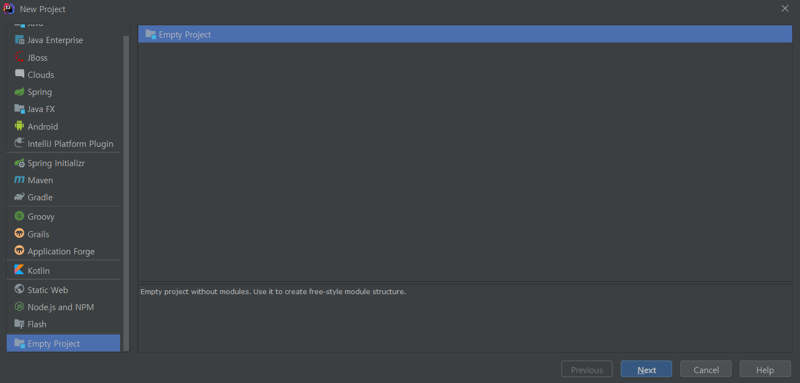
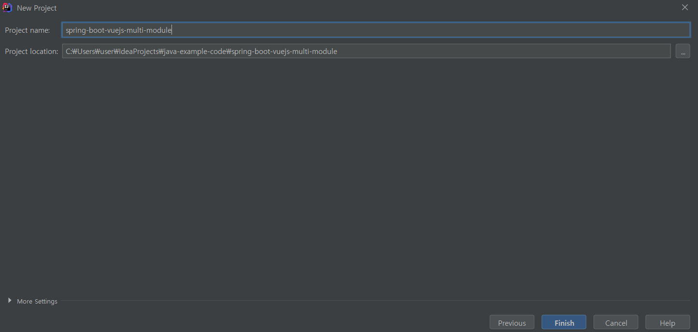
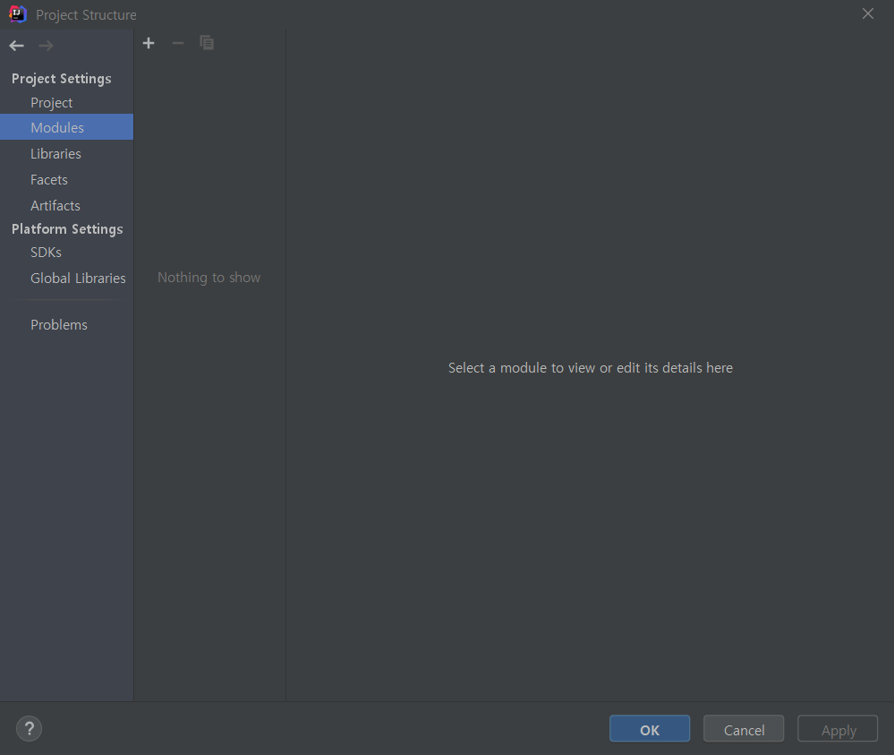

Spring Boot + Vuejs + Gradle (Frontend and Backend Combine)
=========

https://bkjeon1614.tistory.com/39

[]()

## Development Environment 
* IDE : IntelliJ IDEA Ultimate
* SpringBoot 2.0.5.RELEASE
* Java8
* Gradle

## Setup

### Prerequisites

#### MacOSX
```
brew install node
npm install -g vue-cli
vue init webpack frontend
```

#### Linux
```
sudo apt-get update
sudo apt-get install node
npm install -g vue-cli
vue init webpack frontend
```

#### Windows
```
choco install npm
npm install -g vue-cli
vue init webpack frontend
```

#### Project Init & Build Run
```
bash$ vue init webpack frontend 
    
? Project name frontend    → 프로젝트 이름
? Project description A Vue.js project   → 프로젝트 정보 
? Author bkjeon90@gmail.com   → 제작자명
? Vue build standalone    → 빌드방식  
? Install vue-router? Yes    → 뷰 라우터 설치여부
? Use ESLint to lint your code? Yes   → 문법 검사 라이브러리 설치 여부
? Pick an ESLint preset Airbnb     
? Set up unit tests Yes   → 단위 테스트 라이브러리 설치 여부
? Setup e2e tests with Nightwatch? Yes 
? Should we run `npm install` for you after the project has been created? (recommended) (Use arrow keys) Yes, use NPM
? Pick a test runner karma 

    vue-cli · Generated "vue-test". 

    To get started: 

        cd vue-test 
        npm install 
        npm run dev 

    Documentation can be found at https://vuejs-templates.github.io/webpack
```
    
```    
cd frontend
npm install
npm run build
```

## Project setup
```
spring-boot-vuejs
├─┬ spring-boot-vuejs     → backend module with Spring Boot code
│ └── src
│      ├── main
│      └── resources
│            └── application.yml
├─┬ frontend    → frontend module with Vue.js code
│ ├── src
│ ├── config
│       └── index.js    → build path ( move: resources/templates/* )
└── build.gradle    
```

# [Additional Information]
## Spring Boot Vuejs Multi Project (intellij)

Step 1. File -> New -> Project -> Empty Project 선택 후 Next  


Step 2. 아래 그림과 같이 경로를 맞추어 root 프로젝트 생성  


Step 3. 아래 그림과 같은 창이 나오면 Cancel 선택  


Step 4. 필요한 정보를 입력한다.  


Step 5. 필요한 모듈을 선택한다.  


Step 6. back-end api로 구성할 프로젝트를 생성한다. 경로는 위의 2번의 root 프로젝트 경로 하위에 생성하자  


> Project Structure  

