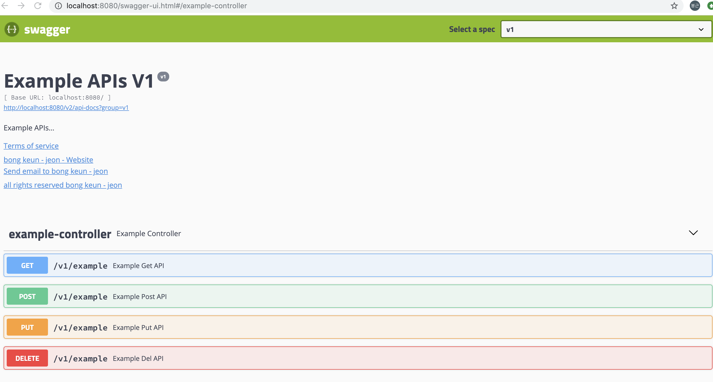

Swagger를 사용한 API문서 자동화
=========



## [Document]
- Tistory: https://bkjeon1614.tistory.com/256
- Github: https://github.com/bkjeon1614/java-example-code/tree/master/swagger-example


## [Development Environment]
- IntelliJ IDEA Ultimate
- SpringBoot 2.1.4.RELEASE
- Java8
- Gradle


## [Description]

### dependencies 추가
  ```
    // const
    def swaggerVersion = '2.8.0'
    
    dependencies {
        ...
    
        // swagger
        compile group: 'io.springfox', name: 'springfox-swagger2', version: swaggerVersion
        compile group: 'io.springfox', name: 'springfox-swagger-ui', version: swaggerVersion
    }
  ```

### Swagger Config 작성  
  [../com/bkjeon/example/config/SwaggerConfig.java]
  ```
    package com.bkjeon.example.config;
    
    import org.springframework.context.annotation.Bean;
    import org.springframework.context.annotation.Configuration;
    import springfox.documentation.builders.ApiInfoBuilder;
    import springfox.documentation.builders.PathSelectors;
    import springfox.documentation.builders.RequestHandlerSelectors;
    import springfox.documentation.service.ApiInfo;
    import springfox.documentation.service.Contact;
    import springfox.documentation.spi.DocumentationType;
    import springfox.documentation.spring.web.plugins.Docket;
    import springfox.documentation.swagger2.annotations.EnableSwagger2;
    
    @Configuration
    @EnableSwagger2
    public class SwaggerConfig {
    
        @Bean
        public Docket adminApi() {
            return new Docket(DocumentationType.SWAGGER_2)
                .groupName("v1")
                .select()
                .apis(RequestHandlerSelectors.basePackage("com.bkjeon.example.api.v1"))
                .paths(PathSelectors.any())
                .build()
                .apiInfo(apiInfo("Example APIs V1", "Example APIs..", "v1"));
        }
    
        @Bean
        public Docket internalApi() {
            return new Docket(DocumentationType.SWAGGER_2)
                .groupName("v2")
                .select()
                .apis(RequestHandlerSelectors.basePackage("com.bkjeon.example.api.v2"))
                .paths(PathSelectors.any())
                .build()
                .apiInfo(apiInfo("Example APIs V2", "Example APIs..", "v2"));
        }
    
        private ApiInfo apiInfo(String title, String description, String version) {
            Contact contact = new Contact("bong keun - jeon", "https://bkjeon1614.tistory.com", "gcijdfdo@gmail.com");
    
            return new ApiInfoBuilder()
                .title(title)
                .description(description)
                .version(version)
                .termsOfServiceUrl("terms of controller url")
                .license("all rights reserved bong keun - jeon")
                .licenseUrl("https://bkjeon1614.tistory.com")
                .contact(contact)
                .build();
        }
    
    }
  ```

### 컨트롤러 작성
  [../com/bkjeon/example/api/v1/controller/ExampleController.java]
  ```
    package com.bkjeon.example.api.v1.controller;
    
    
    import io.swagger.annotations.ApiOperation;
    import org.springframework.web.bind.annotation.DeleteMapping;
    import org.springframework.web.bind.annotation.GetMapping;
    import org.springframework.web.bind.annotation.PostMapping;
    import org.springframework.web.bind.annotation.PutMapping;
    import org.springframework.web.bind.annotation.RequestMapping;
    import org.springframework.web.bind.annotation.RestController;
    
    @RestController
    @RequestMapping("v1/example")
    public class ExampleController {
    
        @ApiOperation("Example Get API")
        @GetMapping
        public String getCallMethod() {
            return "Example Get";
        }
    
        @ApiOperation("Example Post API")
        @PostMapping
        public String setCallMethod() {
            return "Example Post";
        }
    
        @ApiOperation("Example Put API")
        @PutMapping
        public String putCallMethod() {
            return "Example Put";
        }
    
        @ApiOperation("Example Del API")
        @DeleteMapping
        public String delCallMethod() {
            return "Example Delete";
        }
    
    }
  ```
  
  [../com/bkjeon/example/api/v2/controller/ExampleControllerV2.java]
  ```
    package com.bkjeon.example.api.v2.controller;
    
    
    import io.swagger.annotations.ApiOperation;
    import org.springframework.web.bind.annotation.DeleteMapping;
    import org.springframework.web.bind.annotation.GetMapping;
    import org.springframework.web.bind.annotation.PostMapping;
    import org.springframework.web.bind.annotation.PutMapping;
    import org.springframework.web.bind.annotation.RequestMapping;
    import org.springframework.web.bind.annotation.RestController;
    
    @RestController
    @RequestMapping("v2/example")
    public class ExampleControllerV2 {
    
        @ApiOperation("Example Get API")
        @GetMapping
        public String getCallMethod() {
            return "Example Get";
        }
    
        @ApiOperation("Example Post API")
        @PostMapping
        public String setCallMethod() {
            return "Example Post";
        }
    
        @ApiOperation("Example Put API")
        @PutMapping
        public String putCallMethod() {
            return "Example Put";
        }
    
        @ApiOperation("Example Del API")
        @DeleteMapping
        public String delCallMethod() {
            return "Example Delete";
        }
    
    }
  ```  
  
### 결과  
 

### 구조  

